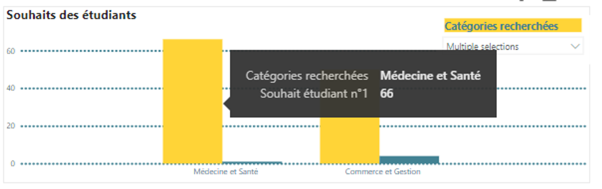
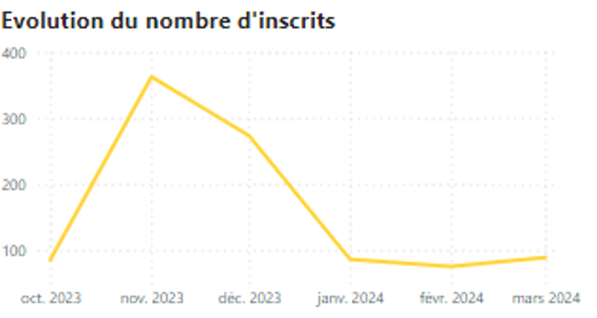
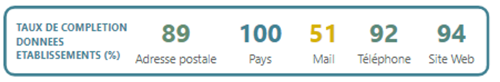
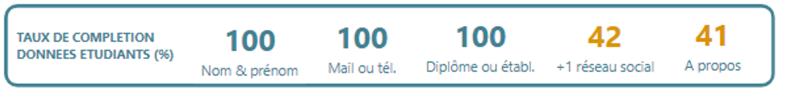
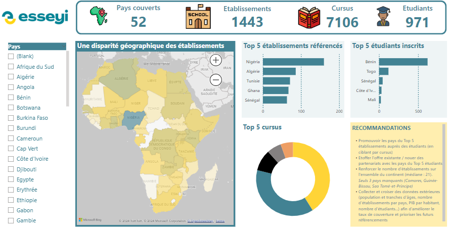
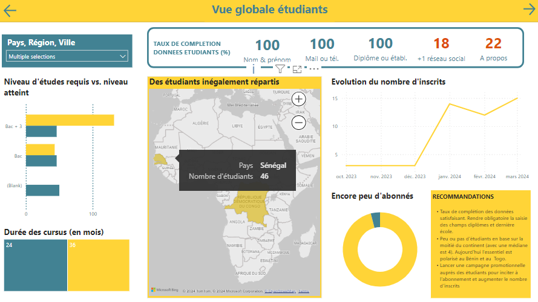
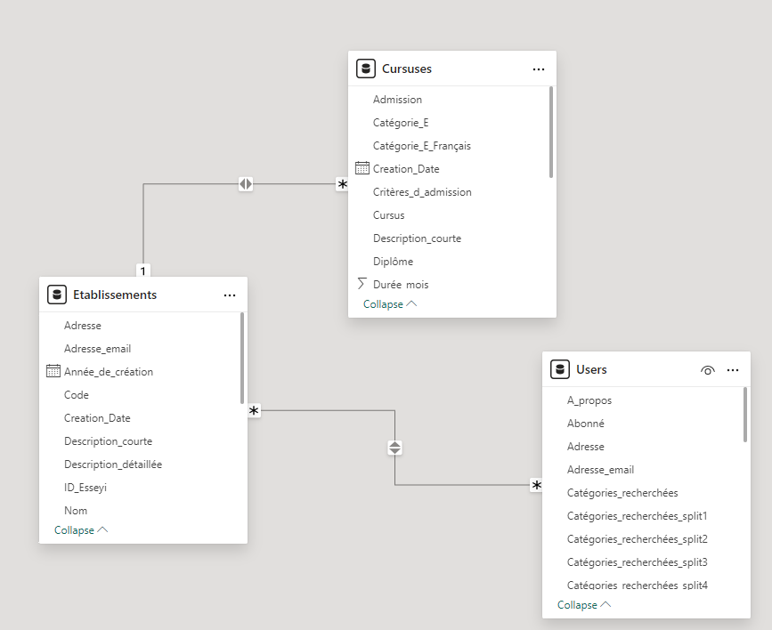

# **Esseyi 🌍**

Esseyi is the first pan-African portal allowing the youth of the continent to orient themselves, study, and work in Africa.

Esseyi, which means "Knowledge" in Ikposso (a language spoken in Togo), aims to digitalize the African student ecosystem:

- Orientation, application, and coaching of students
- Selection and recruitment by Higher Education Institutions
- Validation of diplomas, results, and certificates issued
- Improving the employability of students after graduation

---

## Summary

- Business Demand Overview
- User stories
- Data cleaning
- **Data exploration & transformation**
    - Conversion
    - Calculated fields
    - Transformations
- Final result
- Recommendations

---

## **Business Demand Overview**

- **Reporter**: Emeric / CEO
- **Esseyi’s objective**: to digitalize the African student ecosystem (secondary education)
- **Value of Change** / project objective: to provide an overview of the activity to date + a management tool, to provide business recommendations
- **Necessary Systems & Tools:** SQL Server, Power BI, Excel, CRM (Bubble)
- **Other Relevant Info**: all data has been extracted in .csv format from Bubble in March 2024. The extract contains 3 tables : Establishments, Cursuses & Students.

---

## **User stories**

| No # | As a (role) | I want (request / demand) | So that I (user value) | Acceptance Criteria |
| --- | --- | --- | --- | --- |
| 1 | CEO | To have an overview of Esseyi's data and activity to date | To manage the activity, Identify top/bottom by category, Guide acquisition strategy | Power BI dashboard with key information (number of countries in the catalog, establishments, courses, students, geographical distribution) |
| 2 | CEO | To acquire new institutions | To better meet the needs of students | Power BI dashboard to compare the courses offered with the students' preferences, Completion rate of existing information |
| 3 | CEO | To acquire new students | To better meet the needs of institutions | Power BI dashboard to compare the entry level to the required level, completion rate of information (social networks, emails, etc.) |
| 4 | Institution | A detailed overview of registered users (by country, by course, by, etc.) | To provide additional information, To encourage registration | Power BI dashboard with detailed information on user registration, segmented by country, course, etc. |
| 5 | Student | A detailed overview of available institutions and courses | To compare and choose the best institutions based on my criteria (nationality, geographical, academic) | Power BI dashboard providing a comparative analysis of institution and course offerings, allowing students to compare levels and make informed choices |

---

## **Data cleaning**

### Establishment table

```sql
-- Identifying null values from Establishments
SELECT 
    SUM(CASE WHEN [Adresse] IS NULL THEN 1 ELSE 0 END) AS Adresse,
    SUM(CASE WHEN [Adresse_email] IS NULL THEN 1 ELSE 0 END) AS Adresse_email,
    SUM(CASE WHEN [Année_de_création] IS NULL THEN 1 ELSE 0 END) AS Année_de_création,
    SUM(CASE WHEN [Code] IS NULL THEN 1 ELSE 0 END) AS Code,
    SUM(CASE WHEN [Description_courte] IS NULL THEN 1 ELSE 0 END) AS Description_courte,
    SUM(CASE WHEN [Description_détaillée] IS NULL THEN 1 ELSE 0 END) AS Description_détaillée,
    SUM(CASE WHEN [ID_Esseyi] IS NULL THEN 1 ELSE 0 END) AS ID_Esseyi,
    SUM(CASE WHEN [Nom] IS NULL THEN 1 ELSE 0 END) AS Nom,
    SUM(CASE WHEN [Pays] IS NULL THEN 1 ELSE 0 END) AS Pays,
    SUM(CASE WHEN [Région] IS NULL THEN 1 ELSE 0 END) AS Région,
    SUM(CASE WHEN [Site_web] IS NULL THEN 1 ELSE 0 END) AS Site_web,
    SUM(CASE WHEN [Type] IS NULL THEN 1 ELSE 0 END) AS Type,
    SUM(CASE WHEN [Téléphone] IS NULL THEN 1 ELSE 0 END) AS Téléphone,
    SUM(CASE WHEN [Ville] IS NULL THEN 1 ELSE 0 END) AS Ville,
    SUM(CASE WHEN [Creation_Date] IS NULL THEN 1 ELSE 0 END) AS Creation_Date,
    SUM(CASE WHEN [unique_id] IS NULL THEN 1 ELSE 0 END) AS unique_id
FROM [Esseyi].[dbo].[Etablissements]
```

```sql
-- Deleting columns with more than 60% of missing values

ALTER TABLE [Esseyi].[dbo].[Etablissements]
DROP COLUMN [Autre_pays];

ALTER TABLE [Esseyi].[dbo].[Etablissements]
DROP COLUMN [Code_postal];

ALTER TABLE [Esseyi].[dbo].[Etablissements]
DROP COLUMN [Cursus];

ALTER TABLE [Esseyi].[dbo].[Etablissements]
DROP COLUMN [Direction];

ALTER TABLE [Esseyi].[dbo].[Etablissements]
DROP COLUMN [Facebook];

ALTER TABLE [Esseyi].[dbo].[Etablissements]
DROP COLUMN [Identifiant];

ALTER TABLE [Esseyi].[dbo].[Etablissements]
DROP COLUMN [Nombre_d'étudiants]

ALTER TABLE [Esseyi].[dbo].[Etablissements]
DROP COLUMN [Organisation_mère];
```

```sql
--Identifiying null values per row
SELECT *
FROM (
    SELECT
        *,
        (CASE WHEN [Adresse] IS NULL THEN 1 ELSE 0 END) +
        (CASE WHEN [Adresse_email] IS NULL THEN 1 ELSE 0 END) +
        (CASE WHEN [Année_de_création] IS NULL THEN 1 ELSE 0 END) +
        (CASE WHEN [Code] IS NULL THEN 1 ELSE 0 END) + 
        (CASE WHEN [Description_courte] IS NULL THEN 1 ELSE 0 END) +
        (CASE WHEN [Description_détaillée] IS NULL THEN 1 ELSE 0 END) +
        (CASE WHEN [ID_Esseyi] IS NULL THEN 1 ELSE 0 END) +
        (CASE WHEN [Nom] IS NULL THEN 1 ELSE 0 END) +
        (CASE WHEN [Pays] IS NULL THEN 1 ELSE 0 END) +
        (CASE WHEN [Région] IS NULL THEN 1 ELSE 0 END) +
        (CASE WHEN [Site_web] IS NULL THEN 1 ELSE 0 END) +
        (CASE WHEN [Type] IS NULL THEN 1 ELSE 0 END) +
        (CASE WHEN [Téléphone] IS NULL THEN 1 ELSE 0 END) +
        (CASE WHEN [Ville] IS NULL THEN 1 ELSE 0 END) +
        (CASE WHEN [Creation_Date] IS NULL THEN 1 ELSE 0 END) +
        (CASE WHEN [unique_id] IS NULL THEN 1 ELSE 0 END) AS Nb_valeurs_nulles
    FROM [Esseyi].[dbo].[Etablissements]
    
-- Displaying values with more than 10 missing values
) AS Subquery
WHERE Nb_valeurs_nulles >= 10
```

```sql
-- Deleting the result

DELETE FROM [Esseyi].[dbo].[Etablissements]
WHERE
    (
        (CASE WHEN [Adresse] IS NULL THEN 1 ELSE 0 END) +
        (CASE WHEN [Adresse_email] IS NULL THEN 1 ELSE 0 END) +
        (CASE WHEN [Année_de_création] IS NULL THEN 1 ELSE 0 END) +
        (CASE WHEN [Code] IS NULL THEN 1 ELSE 0 END) + 
        (CASE WHEN [Description_courte] IS NULL THEN 1 ELSE 0 END) +
        (CASE WHEN [Description_détaillée] IS NULL THEN 1 ELSE 0 END) +
        (CASE WHEN [ID_Esseyi] IS NULL THEN 1 ELSE 0 END) +
        (CASE WHEN [Nom] IS NULL THEN 1 ELSE 0 END) +
        (CASE WHEN [Pays] IS NULL THEN 1 ELSE 0 END) +
        (CASE WHEN [Région] IS NULL THEN 1 ELSE 0 END) +
        (CASE WHEN [Site_web] IS NULL THEN 1 ELSE 0 END) +
        (CASE WHEN [Type] IS NULL THEN 1 ELSE 0 END) +
        (CASE WHEN [Téléphone] IS NULL THEN 1 ELSE 0 END) +
        (CASE WHEN [Ville] IS NULL THEN 1 ELSE 0 END) +
        (CASE WHEN [Creation_Date] IS NULL THEN 1 ELSE 0 END) +
        (CASE WHEN [unique_id] IS NULL THEN 1 ELSE 0 END)
    ) >= 10
```

```sql
--Checking duplicates

SELECT unique_id, COUNT(*) AS occurences
FROM [Esseyi].[dbo].[Etablissements]
GROUP BY unique_id
HAVING COUNT(*) > 1;

-- No results :-) 
```

### Cursuses table

```sql
-- Missing values per columns

SELECT 
    SUM(CASE WHEN [Admission] IS NULL THEN 1 ELSE 0 END) AS Admission,
    SUM(CASE WHEN [Autres_informations] IS NULL THEN 1 ELSE 0 END) AS Autres_informations,
    SUM(CASE WHEN [Candidatures_sur_Esseyi] IS NULL THEN 1 ELSE 0 END) AS Candidatures_sur_Esseyi,
    SUM(CASE WHEN [Catégorie_E] IS NULL THEN 1 ELSE 0 END) AS Catégorie_E,
    SUM(CASE WHEN [Coût_annuel] IS NULL THEN 1 ELSE 0 END) AS Coût_annuel,
    SUM(CASE WHEN [Critères_d_admission] IS NULL THEN 1 ELSE 0 END) AS Critères_d_admission,
    SUM(CASE WHEN [Cursus] IS NULL THEN 1 ELSE 0 END) AS Cursus,
    SUM(CASE WHEN [Description_courte] IS NULL THEN 1 ELSE 0 END) AS Description_courte,
    SUM(CASE WHEN [Devise] IS NULL THEN 1 ELSE 0 END) AS Devise,
    SUM(CASE WHEN [Diplôme] IS NULL THEN 1 ELSE 0 END) AS Diplôme,
    SUM(CASE WHEN [Durée_mois] IS NULL THEN 1 ELSE 0 END) AS Durée_mois,
    SUM(CASE WHEN [Début_des_inscriptions_candidatures] IS NULL THEN 1 ELSE 0 END) AS Début_des_inscriptions_candidatures,
    SUM(CASE WHEN [Email] IS NULL THEN 1 ELSE 0 END) AS Email,
    SUM(CASE WHEN [Etablissement_list] IS NULL THEN 1 ELSE 0 END) AS Etablissement_list,
    SUM(CASE WHEN [Etablissement_text] IS NULL THEN 1 ELSE 0 END) AS Etablissement_text,
    SUM(CASE WHEN [Favori_par] IS NULL THEN 1 ELSE 0 END) AS Favori_par,
    SUM(CASE WHEN [Fiche_formation] IS NULL THEN 1 ELSE 0 END) AS Fiche_formation,
    SUM(CASE WHEN [Fin_des_inscriptions_candidatures] IS NULL THEN 1 ELSE 0 END) AS Fin_des_inscriptions_candidatures,
    SUM(CASE WHEN [Frais_de_dossier] IS NULL THEN 1 ELSE 0 END) AS Frais_de_dossier,
    SUM(CASE WHEN [Frais_de_scolarité_par_année] IS NULL THEN 1 ELSE 0 END) AS Frais_de_scolarité_par_année,
    SUM(CASE WHEN [ID_Esseyi] IS NULL THEN 1 ELSE 0 END) AS ID_Esseyi,
    SUM(CASE WHEN [Identifiant] IS NULL THEN 1 ELSE 0 END) AS Identifiant,
    SUM(CASE WHEN [Langue] IS NULL THEN 1 ELSE 0 END) AS Langue,
    SUM(CASE WHEN [Mode] IS NULL THEN 1 ELSE 0 END) AS Mode,
    SUM(CASE WHEN [Niveau_de_sortie] IS NULL THEN 1 ELSE 0 END) AS Niveau_de_sortie,
    SUM(CASE WHEN [Pays] IS NULL THEN 1 ELSE 0 END) AS Pays,
    SUM(CASE WHEN [Programme] IS NULL THEN 1 ELSE 0 END) AS Programme,
    SUM(CASE WHEN [Responsable_du_programme] IS NULL THEN 1 ELSE 0 END) AS Responsable_du_programme,
    SUM(CASE WHEN [Site_web] IS NULL THEN 1 ELSE 0 END) AS Site_web,
    SUM(CASE WHEN [Statut] IS NULL THEN 1 ELSE 0 END) AS Statut,
    SUM(CASE WHEN [Type_Cursus] IS NULL THEN 1 ELSE 0 END) AS Type_Cursus,
    SUM(CASE WHEN [Téléphone] IS NULL THEN 1 ELSE 0 END) AS Téléphone,
    SUM(CASE WHEN [Université] IS NULL THEN 1 ELSE 0 END) AS Université,
    SUM(CASE WHEN [Creation_Date] IS NULL THEN 1 ELSE 0 END) AS Creation_Date
FROM [Esseyi].[dbo].[Cursuses]

-- Deleting columns with more than 60% missing (except Admission & Niveau de sortie)

ALTER TABLE [Esseyi].[dbo].[Cursuses]
DROP COLUMN Autres_informations,
            Candidatures_sur_Esseyi,
            Coût_annuel,
            Devise,
            Début_des_inscriptions_candidatures,
            Favori_par,
            Fiche_formation,
            Fin_des_inscriptions_candidatures,
            Frais_de_dossier,
            Frais_de_scolarité_par_année,
            Responsable_du_programme,
            Statut,
            Type_Cursus,
            Université;
```

```sql
--  Missing values per row
SELECT *
FROM (
    SELECT
        *,
        (CASE WHEN [Adresse] IS NULL THEN 1 ELSE 0 END) +
        (CASE WHEN [Adresse_email] IS NULL THEN 1 ELSE 0 END) +
        (CASE WHEN [Année_de_création] IS NULL THEN 1 ELSE 0 END) +
        (CASE WHEN [Code] IS NULL THEN 1 ELSE 0 END) + 
        (CASE WHEN [Description_courte] IS NULL THEN 1 ELSE 0 END) +
        (CASE WHEN [Description_détaillée] IS NULL THEN 1 ELSE 0 END) +
        (CASE WHEN [ID_Esseyi] IS NULL THEN 1 ELSE 0 END) +
        (CASE WHEN [Nom] IS NULL THEN 1 ELSE 0 END) +
        (CASE WHEN [Pays] IS NULL THEN 1 ELSE 0 END) +
        (CASE WHEN [Région] IS NULL THEN 1 ELSE 0 END) +
        (CASE WHEN [Site_web] IS NULL THEN 1 ELSE 0 END) +
        (CASE WHEN [Type] IS NULL THEN 1 ELSE 0 END) +
        (CASE WHEN [Téléphone] IS NULL THEN 1 ELSE 0 END) +
        (CASE WHEN [Ville] IS NULL THEN 1 ELSE 0 END) +
        (CASE WHEN [Creation_Date] IS NULL THEN 1 ELSE 0 END) +
        (CASE WHEN [unique_id] IS NULL THEN 1 ELSE 0 END) AS Nb_valeurs_nulles
    FROM [Esseyi].[dbo].[Etablissements]
) AS Subquery
WHERE Nb_valeurs_nulles >= 6
```

### Users table

```sql
-- Missing values

SELECT 
    SUM(CASE WHEN [A_propos] IS NULL THEN 1 ELSE 0 END) AS A_propos,
    SUM(CASE WHEN [Abonné] IS NULL THEN 1 ELSE 0 END) AS Abonné,
    SUM(CASE WHEN [Adresse] IS NULL THEN 1 ELSE 0 END) AS Adresse,
    SUM(CASE WHEN [Adresse_email] IS NULL THEN 1 ELSE 0 END) AS Adresse_email,
    SUM(CASE WHEN [Catégorie_recherchée] IS NULL THEN 1 ELSE 0 END) AS Catégorie_recherchée,
    SUM(CASE WHEN [Catégories_recherchées] IS NULL THEN 1 ELSE 0 END) AS Catégories_recherchées,
    SUM(CASE WHEN [CV] IS NULL THEN 1 ELSE 0 END) AS CV,
    SUM(CASE WHEN [Date_de_naissance] IS NULL THEN 1 ELSE 0 END) AS Date_de_naissance,
    SUM(CASE WHEN [Date_dernier_abonnement] IS NULL THEN 1 ELSE 0 END) AS Date_dernier_abonnement,
    SUM(CASE WHEN [Dernier_diplôme_obtenu] IS NULL THEN 1 ELSE 0 END) AS Dernier_diplôme_obtenu,
    SUM(CASE WHEN [Dernier_établissement_étudiant] IS NULL THEN 1 ELSE 0 END) AS Dernier_établissement_étudiant,
    SUM(CASE WHEN [Diplôme_souhaité] IS NULL THEN 1 ELSE 0 END) AS Diplôme_souhaité,
    SUM(CASE WHEN [Ecoles_favorites] IS NULL THEN 1 ELSE 0 END) AS Ecoles_favorites,
    SUM(CASE WHEN [Facebook] IS NULL THEN 1 ELSE 0 END) AS Facebook,
    SUM(CASE WHEN [Fonction] IS NULL THEN 1 ELSE 0 END) AS Fonction,
    SUM(CASE WHEN [instagram] IS NULL THEN 1 ELSE 0 END) AS instagram,
    SUM(CASE WHEN [Langue] IS NULL THEN 1 ELSE 0 END) AS Langue,
    SUM(CASE WHEN [Lettre_de_motivation] IS NULL THEN 1 ELSE 0 END) AS Lettre_de_motivation,
    SUM(CASE WHEN [Linkedin] IS NULL THEN 1 ELSE 0 END) AS Linkedin,
    SUM(CASE WHEN [Mes_candidatures] IS NULL THEN 1 ELSE 0 END) AS Mes_candidatures,
    SUM(CASE WHEN [Mes_cursus_préférés] IS NULL THEN 1 ELSE 0 END) AS Mes_cursus_préférés,
    SUM(CASE WHEN [Mon_parcours] IS NULL THEN 1 ELSE 0 END) AS Mon_parcours,
    SUM(CASE WHEN [Mon_établissement_list] IS NULL THEN 1 ELSE 0 END) AS Mon_établissement_list,
    SUM(CASE WHEN [Niveau_dernier_diplome_étudiant] IS NULL THEN 1 ELSE 0 END) AS Niveau_dernier_diplome_étudiant,
    SUM(CASE WHEN [Nom] IS NULL THEN 1 ELSE 0 END) AS Nom,
    SUM(CASE WHEN [Nom_établissement] IS NULL THEN 1 ELSE 0 END) AS Nom_établissement,
    SUM(CASE WHEN [Pays] IS NULL THEN 1 ELSE 0 END) AS Pays,
    SUM(CASE WHEN [Pays_autre] IS NULL THEN 1 ELSE 0 END) AS Pays_autre,
    SUM(CASE WHEN [Prénom] IS NULL THEN 1 ELSE 0 END) AS Prénom,
    SUM(CASE WHEN [Statut_inscription_Ecole] IS NULL THEN 1 ELSE 0 END) AS Statut_inscription_Ecole,
    SUM(CASE WHEN [Type_d_user] IS NULL THEN 1 ELSE 0 END) AS Type_d_user,
    SUM(CASE WHEN [Téléphone] IS NULL THEN 1 ELSE 0 END) AS Téléphone,
    SUM(CASE WHEN [Ville] IS NULL THEN 1 ELSE 0 END) AS Ville,
    SUM(CASE WHEN [Ville_pays_geo] IS NULL THEN 1 ELSE 0 END) AS Ville_pays_geo,
    SUM(CASE WHEN [Creation_Date] IS NULL THEN 1 ELSE 0 END) AS Creation_Date,
    SUM(CASE WHEN [email] IS NULL THEN 1 ELSE 0 END) AS email
FROM [Esseyi].[dbo].[Users]

-- Deleting columns

ALTER TABLE [Esseyi].[dbo].[Users]
DROP COLUMN [Catégorie_recherchée];

ALTER TABLE [Esseyi].[dbo].[Users]
DROP COLUMN [Date_dernier_abonnement];

ALTER TABLE [Esseyi].[dbo].[Users]
DROP COLUMN [Diplôme_souhaité];

ALTER TABLE [Esseyi].[dbo].[Users]
DROP COLUMN [Ecoles_favorites];

ALTER TABLE [Esseyi].[dbo].[Users]
DROP COLUMN [Fonction];

ALTER TABLE [Esseyi].[dbo].[Users]
DROP COLUMN [Langue];

ALTER TABLE [Esseyi].[dbo].[Users]
DROP COLUMN [Lettre_de_motivation];

ALTER TABLE [Esseyi].[dbo].[Users]
DROP COLUMN [Mes_candidatures];

ALTER TABLE [Esseyi].[dbo].[Users]
DROP COLUMN [Mes_cursus_préférés];

ALTER TABLE [Esseyi].[dbo].[Users]
DROP COLUMN [Mon_parcours];

ALTER TABLE [Esseyi].[dbo].[Users]
DROP COLUMN [Mon_établissement_list];

ALTER TABLE [Esseyi].[dbo].[Users]
DROP COLUMN [Nom_établissement];

ALTER TABLE [Esseyi].[dbo].[Users]
DROP COLUMN [Pays_autre];

ALTER TABLE [Esseyi].[dbo].[Users]
DROP COLUMN [Statut_inscription_Ecole];

ALTER TABLE [Esseyi].[dbo].[Users]
DROP COLUMN [Ville_pays_geo];
```

```sql
-- Missing values per row

SELECT *
FROM (
    SELECT
        *,
        (CASE WHEN [Adresse] IS NULL THEN 1 ELSE 0 END) +
        (CASE WHEN [Adresse_email] IS NULL THEN 1 ELSE 0 END) +
        (CASE WHEN [A_propos] IS NULL THEN 1 ELSE 0 END) +
        (CASE WHEN [Abonné] IS NULL THEN 1 ELSE 0 END) + 
        (CASE WHEN [Catégories_recherchées] IS NULL THEN 1 ELSE 0 END) +
        (CASE WHEN [CV] IS NULL THEN 1 ELSE 0 END) +
        (CASE WHEN [Date_de_naissance] IS NULL THEN 1 ELSE 0 END) +
        (CASE WHEN [Dernier_diplôme_obtenu] IS NULL THEN 1 ELSE 0 END) +
        (CASE WHEN [Dernier_établissement_étudiant] IS NULL THEN 1 ELSE 0 END) +
        (CASE WHEN [Facebook] IS NULL THEN 1 ELSE 0 END) +
        (CASE WHEN [instagram] IS NULL THEN 1 ELSE 0 END) +
        (CASE WHEN [Linkedin] IS NULL THEN 1 ELSE 0 END) +
        (CASE WHEN [Niveau_dernier_diplome_étudiant] IS NULL THEN 1 ELSE 0 END) +
        (CASE WHEN [Nom] IS NULL THEN 1 ELSE 0 END) +
        (CASE WHEN [Pays] IS NULL THEN 1 ELSE 0 END) +
        (CASE WHEN [Prénom] IS NULL THEN 1 ELSE 0 END) +
        (CASE WHEN [Type_d_user] IS NULL THEN 1 ELSE 0 END) +
        (CASE WHEN [Téléphone] IS NULL THEN 1 ELSE 0 END) +
        (CASE WHEN [Ville] IS NULL THEN 1 ELSE 0 END) +
        (CASE WHEN [Creation_Date] IS NULL THEN 1 ELSE 0 END) +
        (CASE WHEN [email] IS NULL THEN 1 ELSE 0 END) AS Nb_valeurs_nulles
    FROM [Esseyi].[dbo].[Users]
) AS Subquery
WHERE Nb_valeurs_nulles >= 15

-- Deleting

DELETE FROM [Esseyi].[dbo].[Users]
WHERE 
    (CASE WHEN [Adresse] IS NULL THEN 1 ELSE 0 END) +
    (CASE WHEN [Adresse_email] IS NULL THEN 1 ELSE 0 END) +
    (CASE WHEN [A_propos] IS NULL THEN 1 ELSE 0 END) +
    (CASE WHEN [Abonné] IS NULL THEN 1 ELSE 0 END) + 
    (CASE WHEN [Catégories_recherchées] IS NULL THEN 1 ELSE 0 END) +
    (CASE WHEN [CV] IS NULL THEN 1 ELSE 0 END) +
    (CASE WHEN [Date_de_naissance] IS NULL THEN 1 ELSE 0 END) +
    (CASE WHEN [Dernier_diplôme_obtenu] IS NULL THEN 1 ELSE 0 END) +
    (CASE WHEN [Dernier_établissement_étudiant] IS NULL THEN 1 ELSE 0 END) +
    (CASE WHEN [Facebook] IS NULL THEN 1 ELSE 0 END) +
    (CASE WHEN [instagram] IS NULL THEN 1 ELSE 0 END) +
    (CASE WHEN [Linkedin] IS NULL THEN 1 ELSE 0 END) +
    (CASE WHEN [Niveau_dernier_diplome_étudiant] IS NULL THEN 1 ELSE 0 END) +
    (CASE WHEN [Nom] IS NULL THEN 1 ELSE 0 END) +
    (CASE WHEN [Pays] IS NULL THEN 1 ELSE 0 END) +
    (CASE WHEN [Prénom] IS NULL THEN 1 ELSE 0 END) +
    (CASE WHEN [Type_d_user] IS NULL THEN 1 ELSE 0 END) +
    (CASE WHEN [Téléphone] IS NULL THEN 1 ELSE 0 END) +
    (CASE WHEN [Ville] IS NULL THEN 1 ELSE 0 END) +
    (CASE WHEN [Creation_Date] IS NULL THEN 1 ELSE 0 END) +
    (CASE WHEN [email] IS NULL THEN 1 ELSE 0 END) >= 15;
```

---

## **Data exploration & transformation**

First ideas by looking the tables separately :

- How to get an overwiew : how many countries, cursus, students
- Filter / Sort results by country / city
- Number of candidates, typology
- What are the most searched categories? Look by country and by institution
- What is the number of students who have filled in textual information?
- Entry level vs. exit level
- Completion rate of tables…

### Conversion

- In Users table, ‘Categories_recherchées’ column was containing values like “Sciences sociales et économiques , Commerce et Gestion , Administration Publique”.

To make future comparisons, I splitted them in Excel in 6 separated colums ‘Categories_recherchées_split1, Categories_recherchées_split2…) to finally get this result :


- Users ‘Creation Date’ was in wrong format and needed to be converted

```sql
-- Add a new colum
ALTER TABLE [Esseyi].[dbo].[Users]
ADD New_creation_date nvarchar(7); 

-- Updating new colum with formated values
UPDATE [Esseyi].[dbo].[Users]
SET New_creation_date = FORMAT(Creation_Date, 'yyyy-MM');
```



### Calculated fields

```sql
-- PowerBI / DAX 

Ratio_Adresse_Non_Nulle = 
DIVIDE(
    COUNT(Etablissements[Adresse]),
    COUNTROWS(Etablissements)
) * 100
```

```sql
-- PowerBI / DAX 

Ratio_Mail_Non_Nul = 
DIVIDE(
    COUNT(Etablissements[Adresse_email]),
    COUNTROWS(Etablissements)
) * 100
```



```sql
-- PowerBI / DAX 

Ratio_Réseaux_Sociaux_Non_Nuls = 
DIVIDE(
    COUNTROWS(FILTER(Users, NOT(ISBLANK(Users[instagram])) || NOT(ISBLANK(Users[Facebook])) || NOT(ISBLANK(Users[Linkedin])))),
    COUNTROWS(Users)
) * 100
```



### Transformation

- Cursuses category were in English in Cursus table and in French in Users table. It needed to get translated have everything standardized.

```sql
-- Creating a new table in French
ALTER TABLE [Esseyi].[dbo].[Cursuses]
ADD [Catégorie_E_Français] NVARCHAR(255) NULL;

-- Copying previous values and by translated ones
UPDATE [Esseyi].[dbo].[Cursuses]
SET [Catégorie_E_Français] = 
    CASE [Catégorie_E]
        WHEN 'agriculture_and_forest_management' THEN 'Agriculture et Gestion des forêts'
        WHEN 'journalism_and_media' THEN 'Journalisme et Médias'
        WHEN 'engineering_and_technology' THEN 'Ingénierie et Technologie'
        WHEN 'business_and_management' THEN 'Commerce et Gestion'
        WHEN 'public_administration' THEN 'Administration Publique'
        WHEN 'education_and_teaching' THEN 'Education et Enseignement'
        WHEN 'economic_and_social_sciences' THEN 'Sciences sociales et économiques'
        WHEN 'it_and_new_technologies' THEN 'Informatique et Nouvelles technologies'
        WHEN 'art_and_architecture' THEN 'Art et Architecture'
        WHEN 'medicine_and_health' THEN 'Médecine et Santé'
        WHEN 'law_and_political_sciences' THEN 'Droit et Sciences Politiques'
        WHEN 'natural_sciences' THEN 'Sciences Naturelles'
        WHEN 'fundamental_and_applied_sciences' THEN 'Sciences fondamentales et appliquées'
        WHEN 'tourism_catering_sports_and_leisure' THEN 'Tourisme, Hotellerie, Sports et Loisirs'
        ELSE [Catégorie_E]
    END;
```

- Replacing NULL values by 0

```sql
UPDATE [Esseyi].[dbo].[Users]
SET [Type_d_user] = COALESCE([Type_d_user], 0)
WHERE [Type_d_user] IS NULL
```

- Replacing NULL values by “Autres”

```sql
UPDATE [Esseyi].[dbo].[Users]
SET 
    [Catégories_recherchées_split1] = CASE WHEN [Catégories_recherchées_split1] = 'NULL' THEN 'Autres' ELSE [Catégories_recherchées_split1] END,
    [Catégories_recherchées_split2] = CASE WHEN [Catégories_recherchées_split2] = 'NULL' THEN 'Autres' ELSE [Catégories_recherchées_split2] END,
    [Catégories_recherchées_split3] = CASE WHEN [Catégories_recherchées_split3] = 'NULL' THEN 'Autres' ELSE [Catégories_recherchées_split3] END,
    [Catégories_recherchées_split4] = CASE WHEN [Catégories_recherchées_split4] = 'NULL' THEN 'Autres' ELSE [Catégories_recherchées_split4] END,
    [Catégories_recherchées_split5] = CASE WHEN [Catégories_recherchées_split5] = 'NULL' THEN 'Autres' ELSE [Catégories_recherchées_split5] END,
    [Catégories_recherchées_split6] = CASE WHEN [Catégories_recherchées_split6] = 'NULL' THEN 'Autres' ELSE [Catégories_recherchées_split6] END
WHERE 
    [Catégories_recherchées_split1] = 'NULL'
    OR [Catégories_recherchées_split2] = 'NULL'
    OR [Catégories_recherchées_split3] = 'NULL'
    OR [Catégories_recherchées_split4] = 'NULL'
    OR [Catégories_recherchées_split5] = 'NULL'
    OR [Catégories_recherchées_split6] = 'NULL';
```

- Improving map filling with countries names

```sql
UPDATE [Esseyi].[dbo].[Users]
SET [Pays] = 'République du Congo'
WHERE [Pays] LIKE 'Congo';

UPDATE [Esseyi].[dbo].[Users]
SET [Pays] = 'Swaziland'
WHERE [Pays] LIKE 'Eswatini';
```

---

## Dashboard overview







---

## Recommendations

- Today there are few registered students compared to the number of institutions. Therefore, prioritize student acquisition. Focus primarily on the top 5 institution countries. Conduct email campaigns targeting by course.
- Promote the top 5 institution countries to students (targeting by course)
- Expand the existing offering / establish partnerships with the top 5 student countries
- Increase the number of institutions across the continent (median: 21)
- Collect and cross-reference external data (population and age groups, number of institutions per country, GDP per capita, number of students, etc.) to improve coverage rates and prioritize future references
- Only 3 missing countries (Comoros, Guinea-Bissau, Sao Tome and Principe)
- Completion rate of data is satisfactory except for email. Make this field mandatory.
- Overall, the most "offered" courses are in commerce and social sciences. The most sought after by students are computer science and medicine.
- Student preferences are partially exploitable as many have not specified. Make this field mandatory by segmenting 1st choice, 2nd choice, 3rd choice.
- There are no students in the database in half of the continent (the median is low 4). Today everything is concentrated in Benin and Togo.
- Launch a promotional campaign to encourage subscriptions and increase the number of registrations
